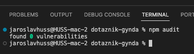

# O aplikaci

Aplikace sbírá a zobrazuje data o stavu pacientů. 


## Instalace

Pro instalaci je potřeba mít nainstalovaný [Node.js](https://nodejs.org/en/) 

1. Stáhněte si zdrojové kódy pomocí ```git clone https://github.com/jaroslavhuss/myomatoza-pbac.git```
2. V kořenovém adresáři nainstalujte závislosti pro aplikační logiku i front-end pomocí `npm install`
3. Aplikace používá dokumentovou databázi MongoDB. MongoDB lze mít nainstalovaný lokálně (https://www.mongodb.com/docs/manual/installation/), pomocí Dockeru (https://hub.docker.com/_/mongo/) a nebo pomocí MongoAtlas, kde si lze vytvořit databázi zdarma (https://www.mongodb.com/cloud/atlas). **Upozorňuji, že sdílení pacientských dat s cloudovou verzi MongoAtlas je z hlediska GDPR problematické.** 
4. Do složky aplikace ``` apps/api/``` je potřeba přidat soubor .env, který obsahuje základní nastavení instance aplikace. Příklad souboru ``` apps/api/.env``` je níže. 

```bash
JWT_SECRET = 5f4dcc3b5aa765d61d8327deb882cf99
JWT_REFRESH_SECRET = 5f4dcc3b5aa765d61d8327deb882cf99
JWT_EXPIRE = 120min
JWT_EXPIRE_REFRESH = 7d
DATABASE_URL = mongodb://localhost:27017/myoms
PORT = 5006
```
Berte prosím za nesmírně důležité změnu hodnot u JWT_SECRET a JWT_REFRESH_SECRET. Tyto hodnoty jsou použity pro šifrování a dešifrování JWT tokenů. Hodnoty můžete vygenerovat pomocí ```openssl rand -hex 40```.

### Spuštění vývojové verze
Pokud si chcete aplikaci spustit ve vývojové verzi, je potřeba:
1. Spusťte aplikaci pomocí  `npm run dev`
2. Front-end aplikace je dostupný na adrese http://localhost:5173/
3. API aplikace je dostupné na adrese http://localhost:5006/

### Spuštění produkční verze
Pokud si chcete aplikaci spustit produkční verzi, je potřeba:
1. Sestavte build aplikace pomocí `npm run build`
2. Přejděte do vybuildované složky `cd /apps/api/dist/src/`
3. Zde vytvořte soubor .env, který obsahuje základní nastavení instance aplikace. Příklad souboru ``` apps/api/.env``` je níže. 

```bash
JWT_SECRET = 5f4dcc3b5aa765d61d8327deb882cf99
JWT_REFRESH_SECRET = 5f4dcc3b5aa765d61d8327deb882cf99
JWT_EXPIRE = 120min
JWT_EXPIRE_REFRESH = 7d
DATABASE_URL = mongodb://localhost:27017/myoms
PORT = 5006
```
4. Spusťte aplikaci pomocí  `node main.js` nebo pomocí process manageru [PM2](https://pm2.keymetrics.io/).
5. Aplikace poběží na portu, který je nastaven v .env souboru. Výchozí hodnota je 5006.

## Pokud se vyskytnou problémy
Pokud se vyskytnou problémy, můžete vytvořit issue v tomto repozitáři. Také mě můžete kontaktovat na emailu jaroslav.huss@gmail.com

## npm audit
Závislosti aplikace jsou zkontrolovány pomocí `npm audit`. Výsledek kontroly je na obrázku níže.


## To-do 
1. Dockerizace aplikace